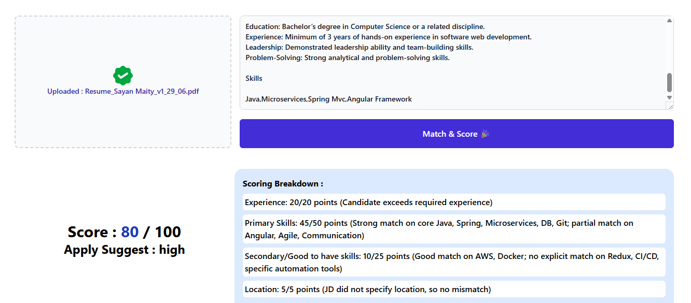
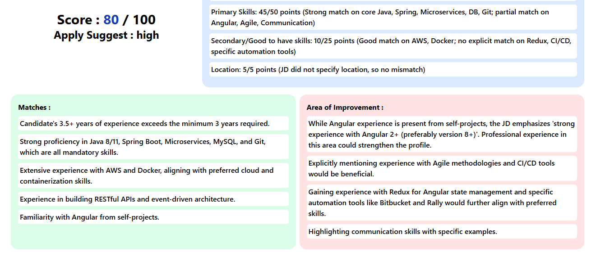

# Resume Inspect AI - Agentic AI 
This is AI-powered small application where We can upload Resume & JD which you wish to apply
It will analysis and suggest the level of alignment and Score based on both, Show you What are the matches and area of improvement.

### Tech Stack Used :
`python3`
`CrewAI`
`gemini`
`Angular`

### Start up instructions :
#### Backend :
``` 
1. Need to be install Python3
2. Clone it -> cd {folder-name}/backend
3. create .env file [GOOGLE_API_KEY = {your_key}]
4. python -m venv venv
5. pip install -r requirements.txt
6. python -m uvicorn main:app --reload
```
#### UI :
``` 
1. Need to be install node , @angular/cli
2. Clone it -> cd {folder-name}/resume-inspect-ai
3. ng serve --open
```

### Preview:

